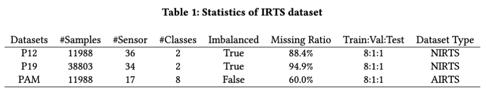

# Irregularity-Informed Time Series Analysis: Adaptive Modelling of Spatial and Temporal Dynamics

## Overview
This repository is  **Official** implementation of MTSFormer code for manuscripts *Irregularity-Informed Time Series Analysis: Adaptive Modelling of Spatial and Temporal Dynamics*, accepted by *CIKM 2024 Full Paper Track*. We proposed a multi-view transformer architecture with adaptive irregularity gate mechanism to unify irregularity learning in Naturally Irregular Time Series(NIRTS) and Accidentally Irregular Time Series(AIRTS). We evaluated our method in 5-fold cross validation under two experiments settings. Please see our paper for more details.

## Datasets
Followed by [Raindrop, ICLR'22](https://arxiv.org/pdf/2110.05357), we used the same data preprocessing. You can download the ready-to-use dataset in [Google Drive](https://drive.google.com/drive/folders/1VrB2mbiF58pS9UggxDecJu8T7qgY53TC?usp=sharing). There are three dataset from real-world application, P12 from ICU monitoring, P19 from sepsis monitoring, PAM from Physical Activity Monitoring. The description of dataset can be found in [Raindrop, ICLR'22](https://arxiv.org/pdf/2110.05357). We give the statistics of dataset:

